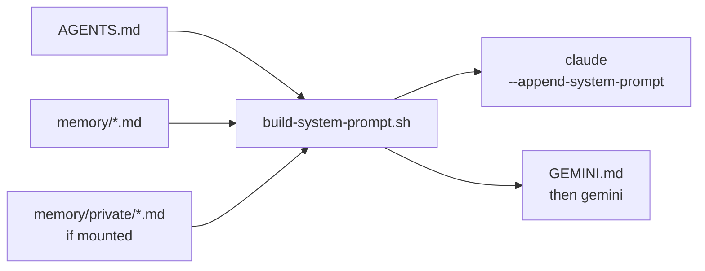

# overmind

[](https://github.com/OR13/overmind/raw/main/.github/assets/after-hours.mp4)

> A personal, file-based coordination system for agentic work — a long-lived
> workspace that sits between you, your tools, and the projects you ship.

It is opinionated about structure but vendor-neutral: it uses [AGENTS.md][agents-md]
as the primary onboarding contract for any coding agent, and treats plain
markdown on disk as the durable substrate for memory, references, and active
work.

This repository is maintained by [@OR13](https://github.com/OR13) for personal
use, but the structure is intentionally generic. Fork it, strip it, and make
it yours.

> [!TIP]
> Five-minute path: clone → `source scripts/overmind.sh` from your shell rc →
> `overmind`. Everything below is the long version of those three steps.

## tldr

```
.
├── AGENTS.md       # agent entry contract
├── .agents/skills/ # Agent Skills (open standard)
├── memory/         # *.md auto-loaded into the system prompt
│   └── private/    # optional gitignored clone for personal context
├── projects/       # active project work; gitignored
├── scripts/        # launcher + prompt assembler
└── .git-ignored/   # local-only scratch
```

## Agent contract

Coding agents (Claude Code, Gemini CLI, Codex, Cursor, Aider, and others)
should read [`AGENTS.md`](AGENTS.md) on entry. If your tool expects a
different filename, symlink it so the static contract stays in one place:

```sh
ln -s AGENTS.md CLAUDE.md
ln -s AGENTS.md .cursorrules
```

> [!NOTE]
> `GEMINI.md` is *not* a symlink — it is regenerated on each launch by
> `scripts/overmind` (gemini backend) and contains the full assembled
> context (`AGENTS.md` + top-level `memory/*.md` + top-level
> `memory/private/*.md` if mounted). It is gitignored.

## Setup

### 1. Clone

```sh
git clone <your-fork> ~/overmind
cd ~/overmind
mkdir -p .git-ignored memory projects
```

If you cloned somewhere other than `~/overmind`, set `OVERMIND_ROOT`
before the next step:

```sh
export OVERMIND_ROOT=/your/path/to/overmind
```

### 2. Install the shell integration

`scripts/overmind.sh` is a sourceable snippet that adds an `overmind`
function to your shell and exports `OVERMIND_ROOT`. Append one line to
your shell profile:

```sh
# zsh
echo 'source ~/overmind/scripts/overmind.sh' >> ~/.zshrc

# bash
echo 'source ~/overmind/scripts/overmind.sh' >> ~/.bashrc
```

Reload with `source ~/.zshrc` (or open a new shell).

### 3. (Optional) Mount a private memory repo

Personal context (identity, role, customer/org names, in-flight private
work, sensitive feedback) lives in a separate private git repo, cloned
into `memory/private/`. The path is gitignored in overmind, so the
private repo's contents never leak into this repo's history.

Create the private repo once (any private remote works; example uses
GitHub via `gh`):

```sh
gh repo create <your-handle>/overmind-private-memory --private --clone=false
```

Clone it as `memory/private/`:

```sh
git clone git@github.com:<your-handle>/overmind-private-memory.git memory/private
```

That's the entire mount. The launcher detects the directory and starts
appending `memory/private/*.md` to the system prompt. If you skip this
step, overmind still works — public memory alone.

`/memory-reflect` writes private items into `memory/private/` and
commits them in that repo (separate history from overmind).

### 4. Launch

```sh
overmind            # default backend (claude)
overmind claude     # explicit claude
overmind gemini     # explicit gemini
```

Set a different default permanently by exporting `OVERMIND_BACKEND`
from your shell profile (before the `source` line):

```sh
export OVERMIND_BACKEND=gemini
```

That's it. The `overmind` function dispatches to `scripts/overmind`, which
assembles the system prompt and exec's the chosen CLI.

## How the launcher works

`scripts/overmind` feeds the *same* assembled context through whichever
backend's native ingestion surface is available:

| Backend | Mechanism |
|---------|-----------|
| Claude  | `claude --append-system-prompt "$(scripts/build-system-prompt.sh)"` |
| Gemini  | writes assembled prompt to `GEMINI.md` (auto-loaded from cwd), then `gemini` |



The assembled context is `AGENTS.md` + every top-level `*.md` in
`memory/` + (when mounted) every top-level `*.md` in `memory/private/`.
Nested subdirectories at either layer (e.g. `memory/playbooks/`,
`memory/private/<topic>/`) are *not* concatenated — they're on-demand
reference. Missing files are silently skipped, so a fresh clone with no
private repo still works.

**Notes:**

- For Claude, `--append-system-prompt` layers the assembled text on top
  of Claude Code's default prompt in interactive mode.
- For Gemini, `GEMINI.md` is the canonical mechanism — Gemini CLI has
  no `--append-system-prompt` flag. The file is gitignored and
  regenerated on every launch; treat it as a build artifact, not a
  source-of-truth document.
- The launcher passes `--skip-trust` to Gemini so it auto-discovers
  project skills (`.agents/skills/`) and project hooks without an
  interactive trust prompt. This is the Gemini-side counterpart to
  Claude's `--permission-mode auto`. Trust is per-session, not
  persisted; remove the flag from `scripts/overmind` if you want the
  prompt back.
- Trailing args pass through: `overmind gemini --yolo` →
  `gemini --skip-trust --yolo` after writing `GEMINI.md`.

## Workspace-scoped secrets

If a skill needs API credentials (e.g. social-media skills, third-party
APIs), keep them in `.git-ignored/secrets.env`. The launcher sources
that file automatically before exec'ing the backend, so the values only
populate inside `overmind` sessions:

```sh
# .git-ignored/secrets.env
export BLUESKY_APP_PASSWORD=...
export X_API_TOKEN=...
```

> [!IMPORTANT]
> Run `chmod 600 .git-ignored/secrets.env` so other users on the
> machine cannot read it. `.git-ignored/` is already gitignored, so
> the values never end up in version control.

## References

- [paperclipai/paperclip][paperclip] — agentic workspace that inspired the
  long-lived, file-based coordination model.
- [How to Build an LLM Knowledge Base][dair-kb] — DAIR.AI's argument for
  curated, structured context as the foundation of useful LLM workflows;
  this workspace's `memory/` tier is one expression of that idea.
- [AGENTS.md][agents-md] — the open standard for agent onboarding files,
  used here as the primary agent contract.
- [Context Repositories][letta-ctx] — Letta's writeup of the public/private,
  evolutionary context-repository pattern that this workspace follows.
- [Dictionary of AI Coding][ai-dictionary] — Matt Pocock's plain-English
  glossary for AI-coding jargon. Useful shared vocabulary for the
  concepts overmind builds on (`AGENTS.md`, memory systems, skills,
  subagents, progressive disclosure, handoff artifacts, compaction).

[paperclip]: https://github.com/paperclipai/paperclip
[dair-kb]: https://academy.dair.ai/blog/how-to-build-an-llm-knowledge-base
[agents-md]: https://agents.md
[agentskills]: https://agentskills.io
[letta-ctx]: https://www.letta.com/blog/context-repositories
[ai-dictionary]: https://github.com/mattpocock/dictionary-of-ai-coding
